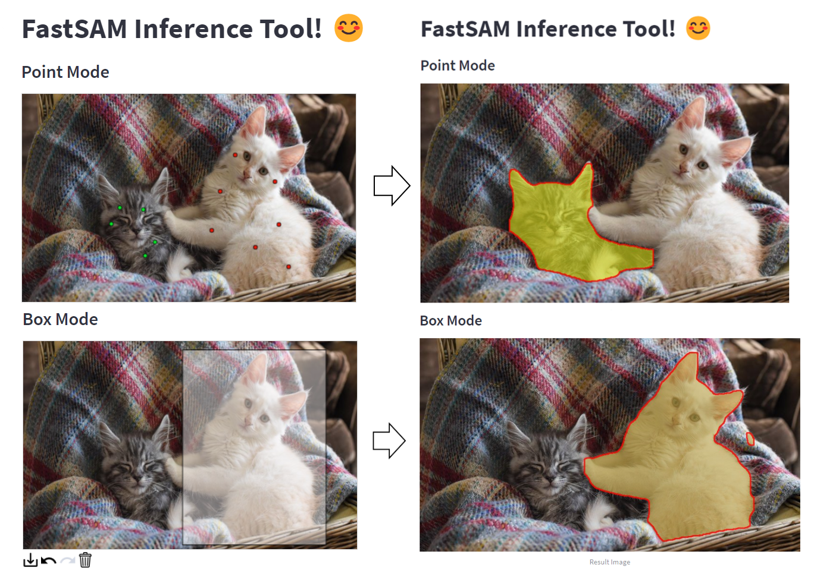
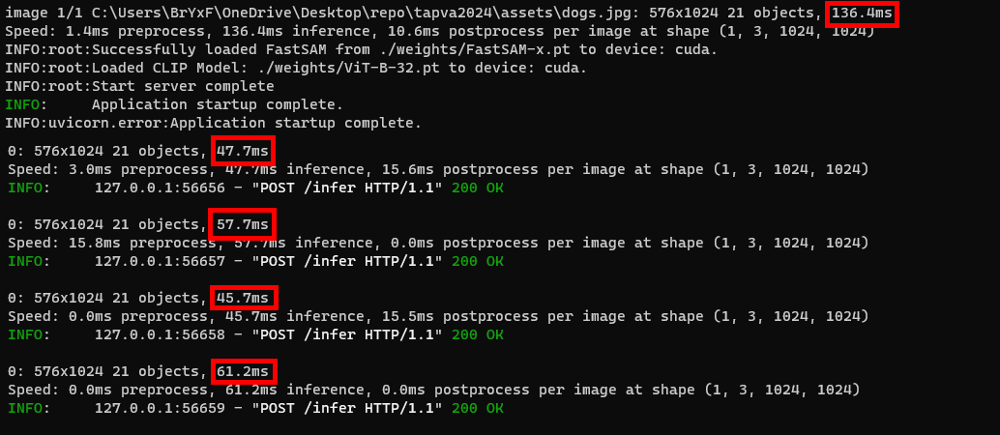

# TAP VA Assessment 2024 - (Siow Wei Kang Bryan)

This project demonstrates how to perform inference using the [FastSAM](https://github.com/CASIA-IVA-Lab/FastSAM) model through FastAPI endpoints. The application is containerized with Docker and includes a Streamlit interface for easy interaction.

Examples:



## Installation

1. Clone the repository:

```
git clone https://github.com/bryanSwk/tapva2024.git
cd tapva2024
```

2. Create the environment:

```
conda create -n FastSAM python=3.9
conda activate FastSAM
```

3. Install Torch from: [Link](https://pytorch.org/get-started/locally/)

4. Install requirements:

```
pip install -r requirements.txt
```

5. Install CLIP:
```
pip install git+https://github.com/openai/CLIP.git
```
## Usage/Examples

Download weights using:

```
./scripts/dl-weights.sh
```

if transfer.sh link expires:

```
ViT-B-32.pt: https://drive.google.com/file/d/1ucNN-iEx4i-omhzuuQMMlSOnndM01CyG/view?usp=drive_link
FastSAM-x.pt: https://drive.google.com/file/d/1qhxab2Qpj08AaqrJMmCby1oEI8QqzDze/view?usp=drive_link

Download and place in tapva2024/weights
```

### IMPORTANT!: Before building inference container, ensure that `scripts/entrypoint/api-entrypoint.sh` has the `LF` as EOL Sequence as git tends to convert it to `CRLF`. (VSCode Bottom Right Corner &#8594; Change CRLF &#8594; to LF)
Alternatively, Download &#8594; [Link](https://drive.google.com/file/d/1z1tOGf77ci3FQM8qDWzH5PntSAooDFh3/view?usp=sharing) &#8594; Save to `./scripts/entrypoint/api-entrypoint.sh`

Build inference container:
```
docker build `
    -t "fastapi:latest" `
    -f docker/fastapi.Dockerfile `
    --platform linux/amd64 .
```
Run FastAPI container:
```
docker run --rm -it -p 4000:4000 `
    --name fastapi-server `
    --gpus all `
    -v "$(Get-Location)\weights:/home/user/tap-va/weights" `
    fastapi:latest
```

or locally:

```
python ./inference_fastapi.py
```


Start Streamlit App:
```
streamlit run app.py
```

## Unit Tests

To run unit tests, spin up an inference container or run it locally.

Run pytest in root dir afterwards:

```
python ./inference_fastapi.py
pytest
```

There are 3 parts to the pytest:

- Health &#8594; Checks for API health.
- Functional &#8594; Checks if each of the inference modes are working.
- Format &#8594; Checks for edge cases, wrong format.

This should be the valid output for the correct configuration:

```
================================================= 10 passed in 7.16s ==================================================
```

## Optimization



First inference request usually takes 2x - 3x the inference time.

### Warm-up

- During model initialization, a dummy prediction is done to reduce downstream inference time.

- Note: You may also use `pytest` to run several predict API calls to allow for [CUDA warm-up](https://github.com/ultralytics/ultralytics/issues/4920) to speed up subsequent inferences, while at the same time testing the API service.


### Pre-loading model in startup event of FastAPI:

- Kept in memory, loaded and ready to serve first request with no downtime.


### Dockerfile

- Optimized to utilize caching, reducing build times.

### [Hydra Config](https://hydra.cc/docs/intro/) &#8594; Easy configuration in `config/config.yaml`.

- Allows for scalable future development work &#8594; cleaner code base without the use of argparse.

## Reference/Resources

- [StackOverflow](https://stackoverflow.com/questions/65504438/how-to-add-both-file-and-json-body-in-a-fastapi-post-request)
- [FastAPI Documentation](https://fastapi.tiangolo.com/)
- [Streamlit Drawable Canvas](https://github.com/andfanilo/streamlit-drawable-canvas)